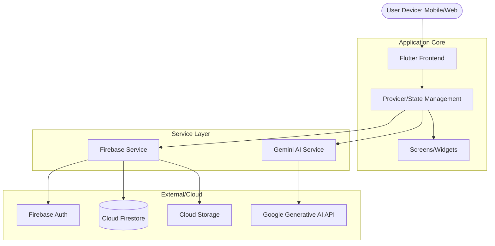
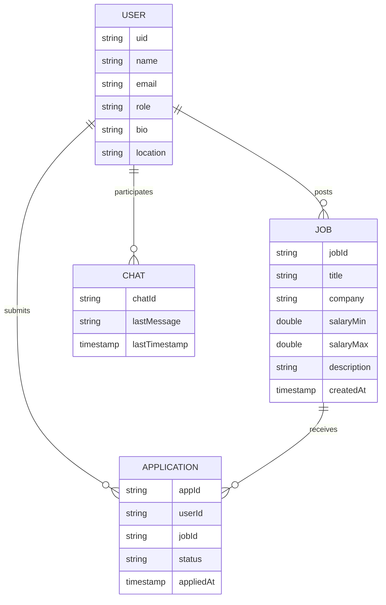

# Final Project Report: Career-IQ
## An AI-Powered Career Development and Recruitment Ecosystem

---

**Student Name:** Shamika Madushan
**Student ID:** [Your Student ID, e.g., kgasmadushan]
**University:** NSBM Green University / University of Plymouth
**Date:** March 31, 2026

---

### **Chapter 01**

#### **1. Introduction**
The contemporary job market is characterized by intense competition and an overwhelming volume of data for both job seekers and recruiters. Traditional job search platforms often act as static repositories, requiring significant manual effort to filter through irrelevant listings or unqualified applicants. **Career-IQ** was developed as a comprehensive mobile and web solution to bridge this gap by integrating generative artificial intelligence (AI) into the core recruitment and career development workflow. The application serves two primary personas: the job seeker, who requires personalized guidance and resume optimization, and the recruiter, who necessitates efficient applicant tracking and communication tools.

#### **1.2 Existing Systems and Problem Definition**
Existing professional networking and job search platforms such as LinkedIn, Indeed, and Glassdoor provide extensive databases but often fail to provide actionable, AI-driven insights to individual users. Job seekers frequently struggle with "resume black holes," where their applications are rejected by automated Applicant Tracking Systems (ATS) without clear feedback. Conversely, recruiters are often inundated with hundreds of resumes for a single position, many of which do not meet the core requirements, leading to "recruitment fatigue" and prolonged hiring cycles.

The identified problems include:
1.  **Lack of Personalization:** Generic job recommendations that do not consider the specific skill trajectory of the user.
2.  **Information Asymmetry:** Recruiters and candidates often have mismatched expectations regarding salary and role requirements.
3.  **Inefficient Communication:** High volumes of messages lead to slow response times and missed opportunities for talent acquisition.

#### **1.3 Project Aims and Objectives**
The primary aim of this project was to design and implement a smart career ecosystem that leverages large language models (LLMs) to enhance the efficiency of the hiring process.

The specific objectives were as follows:
*   To develop an **AI-powered Resume Tailor** that aligns candidate skills with specific job descriptions using the Gemini API.
*   To create a **Salary ROI Analyst** tool providing data-driven salary growth insights and development recommendations.
*   To implement a centralized **Smart Inbox** for recruiters, utilizing AI to suggest relevant actions and responses.
*   To establish a robust, real-time backend using **Firebase** for secure data storage and authentication.
*   To provide an interactive **Mock Interview** platform to boost candidate confidence and preparedness.

#### **1.4 Scope of the Project**
The scope of the Career-IQ project encompasses the development of a cross-platform application (iOS, Android, and Web) using the Flutter framework. 
The system features:
*   **Job Seeker Module:** Profile management, AI resume tailoring, salary insights, job applications, and AI-driven interview practice.
*   **Recruiter Module:** Job posting management, ATS dashboard for applicant tracking, specialized recruiter billing, and a smart inbox.
*   **AI Integration:** Deep integration of the Google Gemini API for natural language processing across all career tools.
*   **Backend Infrastructure:** Real-time database (Cloud Firestore), user authentication (Firebase Auth), and cloud storage for CVs and images.

---

### **Chapter 02**

#### **2. Requirement Gathering Techniques**
The requirements for Career-IQ were gathered through a combination of structured techniques to ensure a user-centric design:
1.  **Competitor Analysis:** A thorough review of current market leaders (e.g., LinkedIn, Indeed) was conducted to identify feature gaps, particularly in AI integration.
2.  **Recruiter Interviews:** Informal consultations with hiring managers were utilized to understand the pain points of existing ATS platforms.
3.  **Literature Review:** Research into the latest trends in Generative AI for recruitment (e.g., automated CV screening) informed the technical feasibility of the project.
4.  **Prototyping & Feedback:** Low-fidelity wireframes were developed and refined based on iterative feedback cycles during the early development stages.

#### **2.1 Functional and Non-Functional Requirements**

**2.1.1 Functional Requirements (FR)**
*   **User Authentication:** Users must be able to sign up and log in as either a "Job Seeker" or "Recruiter" using email or Google Sign-In.
*   **Job Management:** Recruiters must be able to create, edit, and delete job postings with specific metadata (salary range, location, requirements).
*   **AI Resume Tailor:** The system must analyze a user's resume against a selected job description and provide specific suggestions for improvement.
*   **Real-time Messaging:** A chat system must facilitate communication between recruiters and applicants.
*   **Applicant Tracking:** Recruiters must be able to move applicants through various stages (Applied, Interviewing, Hired, Rejected).

**2.1.2 Non-Functional Requirements (NFR)**
*   **Performance:** AI analysis results should be returned within 3-5 seconds to maintain user engagement.
*   **Scalability:** The architecture must support a growing number of concurrent users through Firebase's auto-scaling capabilities.
*   **Security:** All user data, including resumes and contact information, must be protected via Firebase Security Rules.
*   **Usability:** The interface must adhere to modern UI/UX standards, featuring a professional and intuitive design.
*   **Reliability:** The system must maintain high availability, with critical services functioning even during high-traffic periods.

#### **2.2 Features of Application**
Career-IQ distinguishes itself through several "Smart" features:
*   **AI Resume Tailor:** Unlike basic keyword scanners, this tool uses semantic analysis to rewrite bullet points and summaries to match the intent of a job description.
*   **Salary ROI Analyst:** Visualizes potential career trajectories using `fl_chart`, helping users understand the financial impact of acquiring new skills.
*   **Smart Inbox (Recruiter):** Uses AI to summarize candidate messages and suggest "Quick Replies," significantly reducing administrative overhead.
*   **AI Hub:** A centralized dashboard that provides easy access to all career enhancement tools (CV Analysis, Mock Interview, ROI Tracker).

---

### **Chapter 03**

#### **3. Use Case Diagram**
The following diagram illustrates the primary interactions between the actors (Job Seeker, Recruiter, and AI Service) and the system.

```mermaid
useCaseDiagram
    actor "Job Seeker" as JS
    actor "Recruiter" as RT
    actor "Gemini AI" as AI

    JS --> (Browse Jobs)
    JS --> (Apply with AI Tailored Resume)
    JS --> (Practice Mock Interview)
    JS --> (Analyze Salary ROI)

    RT --> (Post New Job)
    RT --> (Manage Applicants in ATS)
    RT --> (Communicate via Smart Inbox)
    RT --> (Manage Billing/Subscription)

    (Apply with AI Tailored Resume) ..> AI : <<include>>
    (Practice Mock Interview) ..> AI : <<include>>
    (Communicate via Smart Inbox) ..> AI : <<include>>
```

#### **3.1 High-Level Diagram (Architecture)**
The system architecture follows a clean, modular pattern using the Flutter framework and Firebase services.



#### **3.2 ER Diagram**
The data model is designed to be flexible and efficient for real-time operations in NoSQL (Cloud Firestore).



#### **3.3 User Interface of the Developed System**
*(Note: Important interfaces described as developed)*
1.  **AI Hub (Discovery Screen):** A premium, glassmorphism-inspired dashboard serving as the gateway to the CV Analysis, Mock Interview, and Salary ROI tools. It uses vibrant gradients and subtle animations to enhance engagement.
2.  **ATS Dashboard (Recruiter):** A clean, data-rich interface where recruiters can see applicant statistics (Applied, In-Review, Shortlisted) at a glance. It integrates horizontal scrolling categories and real-time status updates.
3.  **Resume Tailor Screen:** A split-view interface where users can upload their CV and see real-time AI suggestions for optimization alongside the relevant job description.

---

### **Chapter 04**

#### **4. Development Methodology**
The development of Career-IQ followed an **Agile (Scrum)** methodology. This allowed for iterative progress, frequent testing, and the ability to pivot features based on technical breakthroughs with the Gemini API.

Key aspects of the methodology included:
*   **Sprint Cycles:** Two-week development sprints focused on specific modules (e.g., Firebase Auth, AI Integration).
*   **Test-Driven Development (TDD):** Unit tests were implemented for core logic in providers and models to ensure stability.
*   **Continuous Improvement:** Feedback from peer reviews was incorporated at the end of each sprint to refine the UI/UX.

#### **4.1 Technologies and Tools Used**
*   **Frontend:** Flutter (Dart language) for cross-platform development.
*   **Backend:** Firebase (Firestore, Auth, Storage, Messaging) for real-time features and cloud infrastructure.
*   **Artificial Intelligence:** Google Generative AI (Gemini Pro/Flash) for natural language reasoning.
*   **State Management:** Provider for scalable and efficient data flow across the app.
*   **Visualization:** `fl_chart` for career growth and ROI graphing.
*   **PDF Processing:** `syncfusion_flutter_pdf` and `printing` for document generation (Invoices and Resumes).
*   **Environment Management:** `flutter_dotenv` for secure storage of API keys.
*   **Design:** Custom SVG icons via `flutter_svg` and premium typography from `google_fonts`.

#### **4.2 Future Implementation**
Future enhancements for Career-IQ include:
1.  **Real-time Video Interviews:** Integration of WebRTC for native video conferencing within the application.
2.  **Blockchain-verified Credentials:** Implementing decentralized identity (DID) to verify education and experience records.
3.  **Social Integration:** Deeper connections with professional platforms to import user data and recommendations seamlessly.
4.  **Advanced Analytics:** Predictive hiring models using historical application data to suggest the best candidates for recruiters.

---

### **Chapter 05**

#### **5. Individual Contribution**
**Shamika Madushan (The Lead Developer):**
The author was responsible for the end-to-end architecture and implementation of the Career-IQ platform. Key contributions included the design and development of the Flutter frontend, establishment of the Firebase backend infrastructure, and the deep integration of the Gemini AI API for all career tools. The author also implemented the recruiter billing system and the real-time ATS dashboard, ensuring a professional and high-aesthetic user experience across both job seeker and recruiter personas.

#### **5.1 Github Commit History and Repository Link**
The complete development history, including all modular updates and bug fixes, can be viewed at the official repository:
**GitHub Repository:** [https://github.com/5h3ld0rr/Career-IQ.git](https://github.com/5h3ld0rr/Career-IQ.git)

#### **5.2 Project Source Code Link**
**Source Code (Plymouth OneDrive):** [Insert your OneDrive Share Link here]
*(IMPORTANT: Please ensure you replace this placeholder with your active OneDrive link and ensure access permissions are set to "Anyone with the link" as per the requirement).*

#### **Reference List**
1.  Google. (2024). *Flutter Documentation*. Retrieved from https://docs.flutter.dev/
2.  Firebase. (2024). *Cloud Firestore Documentation*. Retrieved from https://firebase.google.com/docs/firestore
3.  Google AI. (2024). *Gemini API Reference*. Retrieved from https://ai.google.dev/docs
4.  Fowler, M. (2018). *Refactoring: Improving the Design of Existing Code*. Addison-Wesley.
5.  Nielsen, J. (1994). *Heuristic evaluation*. In Usability Inspection Methods. John Wiley & Sons.
